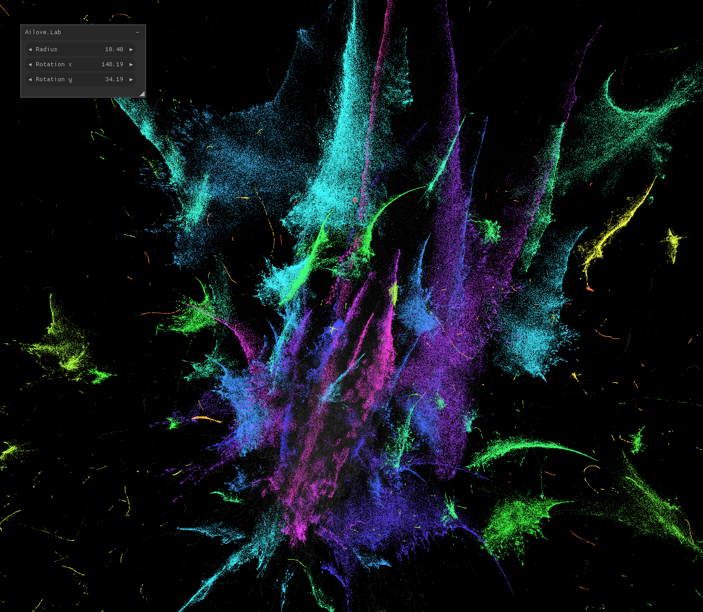

Clusters visualisation
======================

Visualization of large datasets obtained by methods of lowering the dimension, for example, such as UMAP, TSNE.

Dependencies
------------

 * GLFW
 * nuklear ([imgui fork](https://github.com/peko/bbgl/tree/cimgui))
 * gl3w
 * OpenGL 3.3
 * klib

